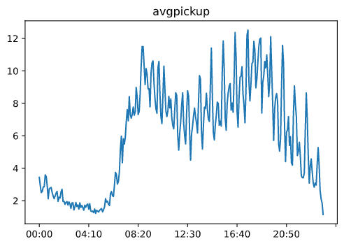
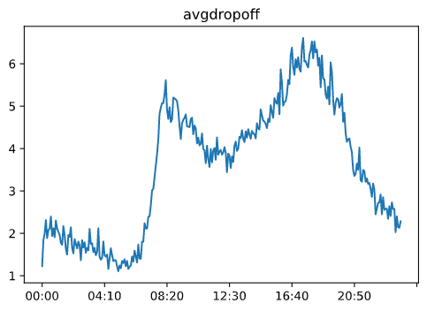
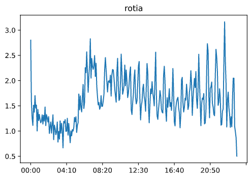
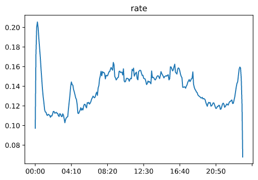
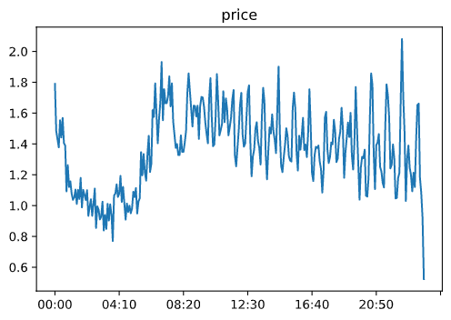
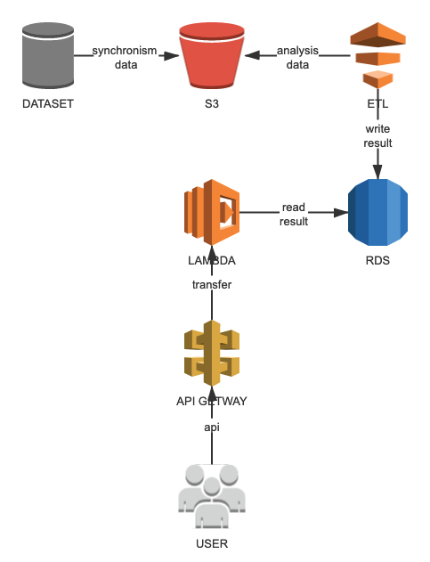

# TLC analysis

## Data Arrangement

According to https://www1.nyc.gov/site/tlc/about/tlc-trip-record-data.page, Get URL address through HTML original text file.

Download all headers.

Analyzed all the tags, and the comprehensive analysis results are obtained.

\1. Some year feature labels are miss.

\2. The address have 2 types, GIS and area id, the area number is selected as the feature after evaluation.

As result, the data from 2017 to 2020 meet the demand of analysis.

The data from 2017 to 2020 were selected and cleaned, we analyzed the ‘fhv,’ ‘green’, ‘yellow’ tables.

## Data Cleaning

Clear the invalid data and select the required feature value according to the label:

|                        | Feature              |                      |                      |
| ---------------------- | -------------------- | -------------------- | -------------------- |
| Table                  | Fhv                  | Green                | Yellow               |
| Order id               | Dispatching_base_num | VendorID             | VendorID             |
| The  date of pick up   | pickup_datetime      | lpep_pickup_datetime | tpep_pickup_datetime |
| The  date of drop off  | dropoff_datetime     | lpep_pickup_datetime | tpep_pickup_datetime |
| Region  id of pick up  | PULocationID         | PULocationID         | PULocationID         |
| Region  id of drop off | DOLocationID         | DOLocationID         | DOLocationID         |

 

## Data theory

We can use time series model training or statistical analysis to analyze the three tables.

This paper adopts the statistical analysis method. Due to the instability of the time series and the prediction of the latest period of data in the future, for drivers and companies, additional statistics are needed, and statistical analysis can analyze the commonness from the data.

It is assumed that the demand supply ratio is strongly related to the month, the time of each moment and the region, and weakly related to the specific date of each month (in fact, weekend and ordinary influence are received, but the overall trend can be considered as similar). Therefore, the dimension of the data table is established as [month, region, time (every 5 minutes)].

Let demand be D and supply P

\1. By analyzing the mean and std at the same time, the number of orders boarding at the same time can be regarded as the increasing demand as 

\2. By analyzing the mean and std at the same time, the number of orders boarding at the same time can be regarded as the increased supply as 

3The change rate of demand / supply ratio at the same time can be calculated from 1,2 as ，the higher the value, the higher the new supply-demand ratio per unit time

4 The order load of vehicles at the same time is analyzed. Through the analysis of each vehicle, there is no order in progress at that time. Assuming that the time between the last order and the next order is less than 1 hour, then the vehicle is regarded as empty，Define the load as =，The higher the value, the higher the vehicle load.

We can think that the step price is positively correlated with the demand supply ratio, and positively correlated with load. Without considering the change of the supply-demand curve (when the price changes, the demand supply curve will change, which will lead to the change of market supply and demand. Due to the lack of conditions for the price to change with the supply-demand curve, we do not consider it) The higher the order load, the higher the step price

## Result Analysis

Because of the large amount of data, the data of January and region 74 is selected as an example

The avg of pick up quantity is shown in the figure below：

The avg of drop off quantity is shown in the figure below：

The change rate of demand supply is shown in the figure below:

The change of order load rate is shown in the figure below：

#### For enterprises

Establish the following step model

Step price = ratio * 0.5 + rate * 4 (parameters can be adjusted, price is limited between 1.0 and 2.0)

Finally, it is summarized into a table with dimensions of month, area and time:

Step price list = function(month, region, time), select the right price at the right time

#### For drivers

They need to know the location and area of order data in each time, and select this area to get more orders at the right time, due to the large amount of data, the January data is selected as an example.

The regional timetable with the largest order data is as follows：

| Date | 00:00 | 01:00 | 02:00 | 0300  | 04:00 | 05:00 | 06:00 | 07:00 | 08:00 | 0900  | 10:00 | 11:00 |
| ---- | ----- | ----- | ----- | ----- | ----- | ----- | ----- | ----- | ----- | ----- | ----- | ----- |
| puid | 255   | 255   | 255   | 255   | 255   | 255   | 255   | 255   | 74    | 74    | 74    | 74    |
| doid | 129   | 129   | 129   | 129   | 129   | 129   | 129   | 129   | 129   | 74    | 74    | 74    |
| Date | 12:00 | 13:00 | 14:00 | 15:00 | 16:00 | 17:00 | 18:00 | 19:00 | 20:00 | 21:00 | 22:00 | 23:00 |
| puid | 74    | 74    | 74    | 74    | 74    | 74    | 74    | 74    | 74    | 74    | 74    | 74    |
| doid | 74    | 74    | 74    | 74    | 74    | 74    | 74    | 74    | 74    | 74    | 74    | 74    |

It can be seen from the graph that area 255 should be selected between 0:00 a.m. and 8:00 a.m. it is reasonable to know that this area may be a gathering place for nightlife. Avoid dropoff in area 129.and it is reasonable to know that it is a living area, while area 74 should be selected between 8:00 and 24:00 a.m., and it is reasonable to know that this area may be a work business center

## AWS Architecture

The use of AWS resources is as follows:

S3: data store

EC2: data organize

Glue: data analysis

RDS: results store

Lambda, API gateway: web api

Process:

\1. The data is synchronized to S3 through the timed task script

\2. ETL creates tables for S3 data

\3. Using spark to analyze the data

\4. The results are stored in database

\5. User access API Gateway

\6. API Gateway calls lambda function

\7. Lambda function calls the data result to get the answer

## Source code address

https://github.com/yueyuelove/tlc.git